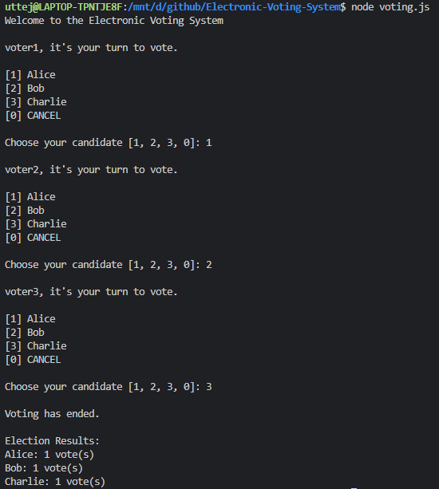
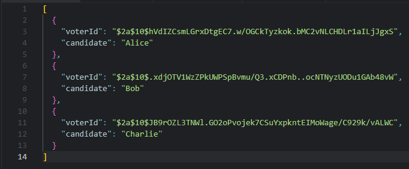

# Electronic Voting System

## Overview

This project is a simple console-based Electronic Voting System built using Node.js. It allows voters to cast their votes anonymously, and the votes are securely recorded using `bcrypt.js` for hashing sensitive voter information. The system ensures that:
- User information remains private and secure.
- Votes cannot be tampered with or traced back to individual voters.

## Features

- **Anonymous Voting**: Voter IDs are hashed before storing to ensure privacy.
- **Secure Storage**: Votes are stored securely in a JSON file.
- **Easy to Use**: The system is simple and easy to use, operated through a console interface.

## Prerequisites

- **Node.js** installed on your machine.
- **npm** (Node Package Manager).

##
- voting.js: Contains the logic for casting votes, hashing voter IDs, and displaying results.
- votes.json: Stores the encrypted votes for later processing and result tallying.

## Screenshots

 

